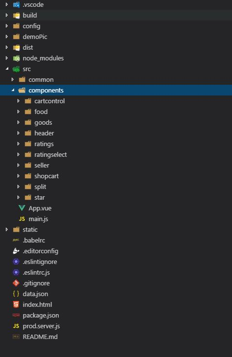
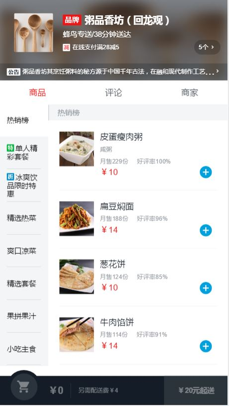
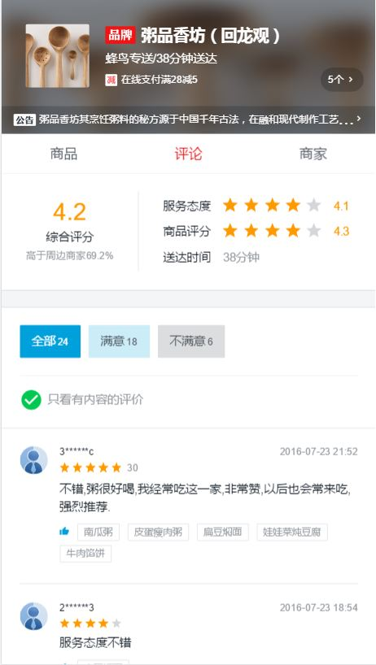
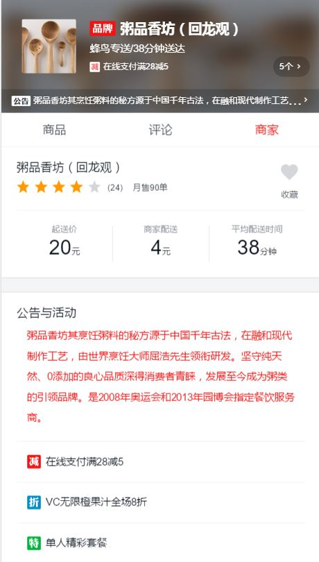
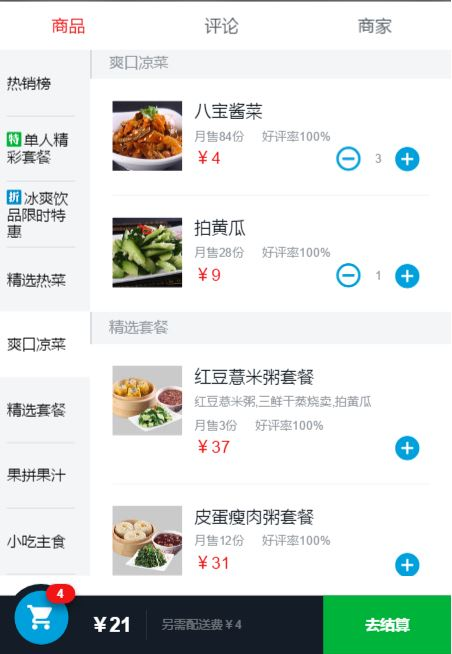
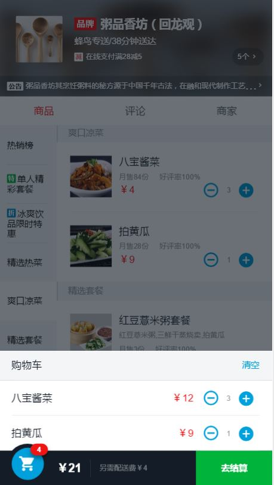
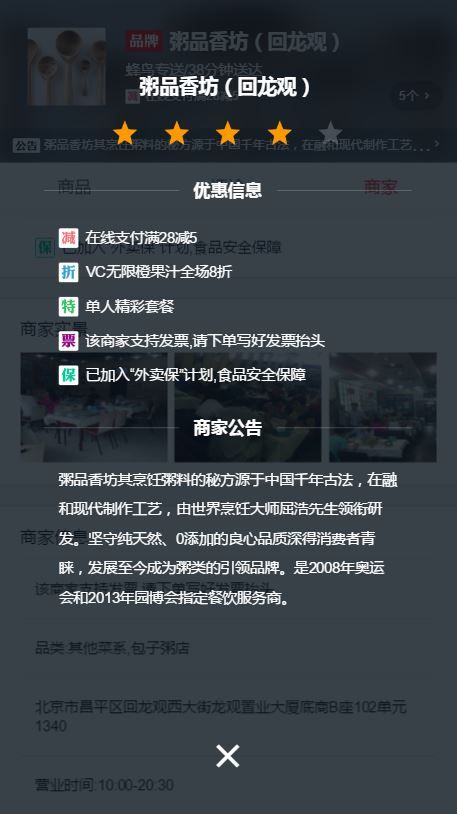

# 基于Vue的外卖商家SPA（VueJs+'Vue-router+Vue-resource+Webpack+ES6+Sass)

> A Vue.js project

Based on VueJs+'Vue-router+Vue-resource+Webpack+ES6+Sass

This project is just for fun and learning Vue.

Still underConstruction


## Build Setup

``` bash
# git clone
git clone https://github.com/laclys/vueApp.git

# install dependencies
npm install

# serve with hot reload at localhost:8080
npm run dev

# build for production with minification
npm run build
```

Please use chrome mobile device mode

## directory structure



## Demo images：












